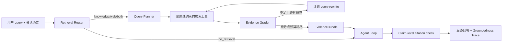

# Agentic RAG 闭环与生产化实现

## 1. 当前结论

聊天链路已经从“模型自行决定是否调用检索工具”升级为显式闭环：



核心原则：无结果时可以改写 query，但不能降低相似度阈值；单个检索工具每轮只允许模型执行一次，超额调用只返回预算跳过结果，不会终止同批其他调用。Router 推荐路线和“必须有证据”是两个独立语义。

## 2. P2 闭环能力

### 2.1 Retrieval Router

入口：`lib/agent/rag/retrieval-router.ts`。

输出四种路线：

| Route | 可见检索工具 | 典型条件 |
|---|---|---|
| `no_retrieval` | 保留受限 fallback；关闭联网时不暴露 Web 工具 | 写作、翻译、普通推理、无需外部证据 |
| `knowledge` | `search_notes` | 明确个人笔记/知识库意图，或命中持久化知识库画像 |
| `web` | `web_search`、`web_fetch` | 最新、实时、官网或公开网络信息 |
| `both` | 知识库与 Web 工具 | 需要对比私有资料和公开/实时资料 |

Router 在 `app/api/chat/route.ts` 中先于 Agent Loop 执行。明确的 knowledge/web/both 路线会约束对应工具；`no_retrieval` 是软路由，保留检索 fallback，避免语言或表达变化造成不可恢复的漏检。`RetrievalPlan.evidenceRequired` 只在用户明确要求私有知识或实时/公开证据时为 true，画像重合仅推荐检索，不会把零证据直接变成拒答。

### 2.2 Query Planner

Planner 生成 `RetrievalPlan`，包含：

- 从恢复后的完整会话历史构造 standalone query。
- `exact/semantic/multi-hop/balanced` query 类型。
- 最多两个子问题或 query rewrite。
- 已归一化的页面 ID、标题、安全来源类型和时间范围过滤条件；“网页/链接”不会被误当成个人知识库内部的 `web` 来源过滤器。
- tenant 对应的知识库 `indexVersion`。

知识库结构化过滤当前在融合候选后执行；Web 时间范围会传给 Provider。数据量继续增长时，应把 page/title/time 条件下推到 SQL RPC，减少无效候选和向量传输。

### 2.3 Evidence Grader 与有限循环

`lib/agent/rag/evidence-grader.ts` 综合以下信号：

- top evidence score；
- query 词面覆盖；
- vector/keyword 双路一致性；
- 多条支持证据；
- top score gap。

规则版 Grader 输出 `strong/acceptable/weak/none`。证据不足时只允许执行第二条计划 query，仍使用同一个 `ragConfig.similarityThreshold`。不存在 threshold=0 或 0.5→0.4 fallback。

### 2.4 EvidenceBundle

`EvidenceBundle` 保存：

- `evidenceId`：稳定的 `ev_<12 hex>`；
- `chunkId/documentId/documentVersion/indexVersion`；
- vector、keyword、fusion、rerank、Cross-Encoder 或 Provider 分数；
- `private_user_content/public_primary/public_secondary/public_unverified` 信任级别；
- URL、heading path、字符位置和 quoted text；
- 每次 query attempt、缓存命中、改写原因、评分与分阶段耗时。

工具会把通过单条最低接受线的证据放进 bundle。整体充分性不足时仍允许模型看到这些候选，但上下文会明确标记低置信度；真正未通过最低线的结果只进入 Trace。`web_fetch` 成功读取的正文始终进入 evidence/artifact，不会因跨语言词面覆盖不足而被替换成拒绝语。

### 2.5 Claim-level citation 与 Groundedness

检索证据存在时，最终回答必须使用 `[ev_xxxxxxxxxxxx]`。运行时会缓存最终流式文本，执行逐 claim 校验后再发送。只有 `evidenceRequired=true` 且确实没有任何证据时才确定性拒答；画像软命中但模型直接回答时保留原答案：

- citation precision：每条引用与其 claim 的词面支持率；
- citation coverage：有引用的 claim 比例；
- groundedness：被证据支持的 claim 比例；
- unknown citation IDs；
- 每个 claim 的引用和支持检查。

当前校验器是确定性词面代理，不是 NLI 模型或 LLM Judge。它适合阻止未知引用和明显无依据的 claim，但不能证明语义蕴含、数值一致性或来源是否权威。高风险场景仍应增加 NLI/LLM Judge 和人工抽检。

### 2.6 知识库画像

聊天请求只读取 `knowledge_profiles` 快照，不再扫描 `compiled_wiki_pages/notion_pages`。直接同步完成后异步刷新；ingestion worker 完成后会等待刷新落库。刷新按用户去重，画像中的 source hash 同时作为聊天检索缓存的 index version。

## 3. P3 可观测与评测

### 3.1 Trace

Trace 新增 `retrieval` 和 `answer_validation` step。详情页展示：

- route、原因、置信度和 index version；
- query attempts、rewrite reason、过滤条件和缓存命中；
- `thresholdFallback`、score gap、证据数量和降级原因；
- embedding、vector、keyword、fusion、rule/Cross-Encoder rerank、MMR、total 耗时；
- citation precision、coverage、groundedness 和 guard 状态。

工具入参、chunk 摘要、引用和 Trace 在本地落库前执行邮箱、手机号和常见 secret 格式脱敏。Langfuse 顶层 query/route metadata 也使用脱敏副本。

### 3.2 评测命令

路由评测不访问外部服务：

```bash
npm run test:rag-routing -- --min-accuracy 0.9 \
  --min-retrieval-precision 0.9 --min-retrieval-recall 0.9
```

真实知识库检索评测：

```bash
npm run test:rag -- --experiment agentic-rag-v2 \
  --out reports/rag-eval/current.json
```

与基线比较，任一核心指标绝对回退超过 0.02 时退出非零：

```bash
npm run test:rag -- --baseline reports/rag-eval/baseline.json \
  --max-regression 0.02 --out reports/rag-eval/candidate.json
```

一键消融 Query Rewrite、Keyword、Rerank 和 MMR：

```bash
npm run test:rag-ablation -- --user-id <uuid>
```

聚合线上回答校验 Trace：

```bash
npm run test:rag-groundedness -- --user-id <uuid> \
  --min-citation-precision 0.8 --min-groundedness 0.75
```

检索报告包含 Recall@K、MRR、二元 relevance 的 nDCG@K、no-result accuracy、关键词覆盖和延迟。报告会标记 `explicit_source` 或 `keyword_proxy`：当前只有关键词的 case 使用代理 relevance；要获得严格指标和多级 nDCG，必须补 page/chunk gold label 与 0/1/2/3 relevance。

## 4. 缓存

两层进程内 LRU+TTL 缓存：

- Query embedding cache：逐 rewrite query 缓存，支持批量部分命中。
- Retrieval result cache：缓存 `search_notes` 和 `web_search` 的结构化结果。

键包含 tenant、index version、source、规范化 query、filters、threshold、limit、search depth 和 strategy version。Web 使用独立的 `web-live` index version，不随个人知识库画像更新失效。返回值使用 defensive clone，避免调用方修改缓存内容。

当前缓存是单进程内存缓存。多实例部署时应迁移到 Redis，并保留相同键契约、TTL、容量和按 tenant 删除能力。

## 5. Ingestion Worker、重试与 DLQ

生产队列由 `rag_ingestion_jobs` 驱动：

- `enqueue_rag_ingestion_job` 使用 advisory lock 合并同一用户/页面的活跃任务；
- `claim_rag_ingestion_jobs` 使用 `FOR UPDATE SKIP LOCKED` 原子领取；
- job 带 lease，worker 崩溃后 lease 到期可重新领取；
- 每次领取增加 attempts；失败按 5 秒起步指数退避，最多 5 分钟；
- 默认三次失败后进入 `dead`；
- DLQ job 可通过 API replay 或 cancel；
- 同步本身使用 embedding 幂等键和数据库原子替换，因此 worker 重试不会留下半页索引。

API：

- `POST /api/knowledge/ingestion/jobs`：入队。
- `GET /api/knowledge/ingestion/jobs?status=dead`：查看 DLQ。
- `PATCH /api/knowledge/ingestion/jobs/:id`：`replay/cancel`。
- `GET /api/cron/rag-ingestion`：cron worker。生产环境必须配置 `CRON_SECRET`，接受 Vercel 的 `Authorization: Bearer` 或显式 `x-cron-secret`，不信任可伪造的 User-Agent。

本地领取一批：

```bash
npm run rag:ingestion:work
```

现有 `/api/knowledge/sync` 仍保留直接流式同步，以兼容当前知识库页面。生产调用应逐步切换到 jobs API，并在 UI 中轮询 job 状态。

## 6. 索引版本与回滚

每次同步把页面内容 hash 写入 `notion_pages.metadata.index_version`。数据库 trigger 在页面版本更新、旧 chunks 被删除前，把页面元数据、全部 chunks 和 embeddings 保存到 `rag_index_snapshots`。

API：

- `GET /api/knowledge/versions?pageId=<id>`：查看 active version 和历史快照。
- `POST /api/knowledge/versions/rollback`：传 `input/indexVersion/confirm=true` 原子恢复。

回滚前 trigger 会自动快照当前 active version，因此支持回滚后再前滚。快照包含 embeddings，容量需要纳入数据库预算和保留策略；后续可将冷快照迁到对象存储。

## 7. 数据治理

- Trace 默认保留 30 天，`retention_until` 有独立索引。
- `npm run traces:cleanup` 调用 `purge_expired_agent_traces`。
- `DELETE /api/traces/:id` 删除单条 Trace。
- `DELETE /api/traces` 且 `confirm=true` 删除当前用户全部 Trace。
- 知识库 reset 删除当前用户的 chunks、页面、wiki 和画像。
- snapshot/job 表通过 `user_id` 级联删除，RLS 只允许用户读取自己的记录；写入和 worker RPC 只授权 service role。

当前脱敏是模式匹配，不是通用 DLP。企业数据还应补字段级分类、租户保留策略、法律冻结、导出审计和密钥管理系统。

## 8. 必须执行的迁移

新能力依赖以下两个新增迁移：

1. `docs/schemas/migrations/20260717-rag-governance.sql`
2. `docs/schemas/migrations/20260717-rag-ingestion-production.sql`

它们依赖基础 RAG、多租户、原子同步和 `agent_traces` schema 已存在。迁移未执行时：Trace 写入会自动降级为不带 retention 字段；ingestion jobs、DLQ、快照和回滚 API 不可用。

本轮代码不会自动执行 SQL。迁移应先在测试 Supabase 验证，再按上述顺序应用到生产。
