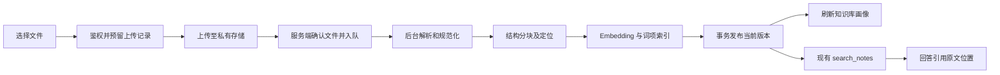

# RAG 自定义上传文档方案

状态：已被 [rag-file-sources.md](./rag-file-sources.md) 取代。首版 MVP 已于 2026-10-02 实现，实际数据模型与本文不同：复用 `notion_pages` 加 `source_type`，未新建独立来源表。本文仅保留作远期设计参考，包括版本替换、停用开关、页数与并发限额、OCR 等尚未实现的部分；以实现文档和 `docs/schemas/migrations/20261002-rag-file-sources.sql` 为准。

## 目标与首版范围

用户在知识库中上传文件，后台解析和索引完成后，现有 `search_notes` 可以同时检索 Notion 与上传资料。回答引用能打开原文件并定位到相应页码或段落。文件更新失败时，旧版本继续可查；删除或停用立即退出检索。

首版支持 UTF-8 TXT、Markdown、文本型 PDF、DOCX。暂不处理扫描件 OCR、图片理解、旧版 DOC、PPTX、表格计算和压缩包。混合 PDF 中有正文的页面可以解析，但必须提示未识别的扫描页，不能把它标成完整解析。以下限制是建议初值，落实时依据容器内存和压测调整：单文件 20 MB，PDF 200 页，每批 10 个文件，每用户最多两个并行解析任务，并设解析后文本/token 上限。

## 当前代码的可复用部分与缺口

| 位置 | 已有能力 | 本次需要的变化 |
| --- | --- | --- |
| `lib/knowledge/loaders.ts` | 本地 Markdown 文件读取 | 增加按格式解析器，输出结构化内容和定位信息 |
| `lib/knowledge/chunking.ts` | 标题、段落、代码、表格与 token 分块 | 保留页码/段落定位，并维护规范化文本的 offset 映射 |
| `lib/knowledge/sync.ts` | Notion 加载、parent 上下文、embedding、原子写入 | 抽出来源无关的索引服务，Notion 与文件分别作为输入适配器 |
| `lib/knowledge/ingestion-queue.ts` | 重试、领取任务、租约 | 从 Notion page job 扩展为 source/version job，补租约续期和过期 worker 发布保护 |
| `lib/knowledge/retriever.ts` | 混合召回、精排、MMR | RPC 从通用来源取标题与链接，限定当前生效版本 |
| `lib/agent/tools/search-notes.ts` | sourceTypes 已包含 document | 补通用 sourceIds 过滤、文件引用和最终可见定位 |
| `app/api/knowledge/pages/route.ts` | Notion 页面列表 | 增加通用来源列表接口，保留旧接口兼容 |
| `lib/agent/tools/knowledge-profile.ts` | Notion/Wiki 画像 | 将上传文档的标题/摘要纳入画像与缓存版本 |
| `lib/chat/image-storage.ts` | Supabase 文件上传/签名读取模式 | 可参考鉴权方式；原文档使用独立私有 bucket |

当前 `documents` 实际是 chunk 表，不建议再创建一套仅用于上传的向量表，也不建议把文件伪装成 Notion 页面。

## 端到端流程



1. 服务端以登录身份分配 `sourceId/versionId` 和上传路径，不接受客户端指定 userId 或任意存储路径。
2. 浏览器直接上传到私有 bucket。小文件可用签名上传；大文件使用支持续传的上传方式。上传意图限定路径、类型、大小和有效期，不开放 bucket 全量写权限。
3. 完成接口检查路径归属、实际对象、大小和文件头，随后幂等创建 ingestion job。页面即可关闭；处理不依赖 HTTP 连接存活。
4. Worker 在受资源限制的独立进程解析文件，生成结构化文本、页码/标题路径和解析警告。空正文或超限应明确失败。
5. 复用既有分块、向量校验、parent 生成和 embedding 客户端。chunk 保留来源、版本与定位。
6. 新 chunks 先写入待发布版本。单一事务校验数量与版本归属，再切换 `active_version_id`，完成 job，并递增用户知识库 revision。
7. 新版本发布后异步刷新画像；revision 已在事务内更新，检索缓存不等待画像刷新才失效。

对象存储和数据库无法使用同一个事务；必须以幂等确认、事务内任务记录和孤立对象清理完成补偿。

## 数据模型

### 新增 knowledge_sources：逻辑文档

```text
id, user_id
source_type: notion | document
external_id: Notion pageId，上传文件可为空
original_filename, title, media_type
active_version_id, latest_version_id
enabled, deleted_at
created_at, updated_at
```

`sourceId` 是稳定的文档身份。更新文件不改变它。文件名不作为唯一键：同名文件可能是不同文档，替换必须显式选择已有文档。

### 新增 knowledge_source_versions：不可变文件与索引版本

```text
id, source_id, user_id
storage_path, file_size, file_sha256
normalized_content_path, normalized_hash
parser_version, chunker_version, embedding_signature
status: awaiting_upload | queued | processing | ready | failed | cancelled | superseded
phase: validating | parsing | chunking | embedding | publishing
page_count, parsed_page_count, chunk_count, warnings, last_error
created_at, completed_at
```

上传原文件路径：`<userId>/<sourceId>/<versionId>/original.<ext>`。原文件和规范化内容保存在私有 bucket；数据库保存路径，不保存会过期的签名 URL。Notion 版本不要求有文件存储路径。

处理状态属于 version。检索只看 source 的当前生效版本：已有生效版本时，新版本处于 processing/failed 不会让旧版本退出检索。

### 扩展现有 documents：复用 chunk 表

新增 `source_id/version_id`，索引唯一键为 `(version_id, chunk_index)`。保留 `content/embedding/metadata/lexical_vector`，复用现有中文 GIN 索引。

- 迁移期保留 `notion_page_id/page_id` 兼容旧逻辑。
- chunk metadata 统一写 `source_type/page_title/heading_path/content_hash`，保证已建词项索引仍有标题数据。
- 添加 `page_start/page_end/block_ids` 等定位信息；PDF 尽量按页内结构分块，跨页块记录范围。
- `start_char/end_char` 对应持久化的规范化文本，不能直接当作原始 PDF 文件 offset。
- 来源、版本与 chunk 的 userId 使用复合外键或等效约束校验，避免跨用户关联。

### 扩展 rag_ingestion_jobs 与 revision

job 增加 `source_id/version_id/job_kind/lease_token/progress`。旧 Notion enqueue RPC 可以作为兼容入口，保留既有 tree/force 语义；上传走新的版本入队接口，不调用 Notion pageId 校验。

新增用户级 `knowledge_index_revision`。版本发布、启停和删除都在事务内递增 revision，用于结果缓存。embedding 模型签名包含 provider/config revision、模型和维度；更换模型时不得将不同向量空间的索引混用。

## 解析器与结构保留

统一输出 `ParsedDocument { blocks, warnings, parserVersion }`，每个 block 包含 `text/kind/headingPath/locator`。

| 格式 | 建议实现 | 引用位置 |
| --- | --- | --- |
| TXT | Node 读取，检查 UTF-8，按段落组织 | 段落/行号 |
| Markdown | 保留标题、代码和表格，适配现有分块 | 标题路径/行号 |
| 文本型 PDF | PDF.js 的 Node 文本接口；根据页面坐标重建阅读顺序 | 页码、可选文字区域 |
| DOCX | Mammoth 的语义 HTML 转换，再规范化为标题/段落/表格 block | 标题路径/段落；不承诺 Word 排版页码 |

多栏 PDF、复杂表格和页眉页脚需要单独质量样本。不得只把 PDF text items 无序拼接，也不得把 DOCX 表格各单元格打散成互不相关的正文。首版 PDF 可明确只保证常规文本版式，发现提取异常则显示警告。

解析器不执行文件中的宏或指令；转出的 HTML 不直接作为可信 HTML 渲染。限制解压大小、正文长度、运行时间和内存，解析进程不下载文档中的外部资源。

## 更新、去重、失败与删除

- 文件 hash 由服务端确认。只在同一用户内判断重复，避免泄露其他用户是否拥有某个文件。
- 同一 source 的相同文件可跳过文件解析；normalized hash 与解析器/分块器/embedding 签名一致时复用相应阶段产物。
- 首版支持整文档新版本重建；chunk 级向量复用可后续按内容 hash 和 embedding 签名添加。
- 每次入队固定 target version。Worker 定期续租；发布事务校验 lease token、未删除状态及目标是否仍为 latest version，过期或被替换的 worker 不能覆盖新结果。
- 网络错误可重试；损坏文件、空正文、未支持格式、扫描件无文字层等给出可行动的错误说明。
- 删除先在事务里标记 source 不可检索、取消未完成任务并更新 revision，再异步清理原文件、版本和 chunks。
- 启停也更新 revision。清理上传未确认的文件和未发布版本使用独立清理任务；不允许迟到的 worker 恢复已删除文档。

## 检索、路由与引用

向量和关键词 RPC 必须查询通用 source，并同时约束：`source.user_id = 当前用户`、enabled、未删除、`chunk.version_id = source.active_version_id`。Notion 和上传文件先共用现有混合召回、RRF、精排、MMR、证据门槛与 2400-token 上下文。

新增 `sourceIds` 过滤，用通用 UUID 选择文件；`pageIds` 保留为 Notion 外部 pageId 的兼容字段。内部结果增加 sourceId/versionId/sourceType/locator，逐步替代 Notion 命名的 pageId/pageUrl，不让新功能继续依赖 Notion ID 解析器。

知识库画像覆盖两种来源。路由显式识别“我上传的文件”“附件文档”“根据这份资料”等表达。对话选择具体文档时，使用 sourceIds 硬过滤，不能把用户选中的文档仅作为模糊搜索关键词。

引用使用稳定的应用链接，例如 `/knowledge/documents/<sourceId>/versions/<versionId>?page=12`，必须绑定回答使用的版本。打开时鉴权，再生成短时原文件访问 URL。PDF 定位页码；Markdown/DOCX 展示规范化文本并定位标题/段落。文档已删除时明确显示不可用，不悄悄跳转到新版本。

上传内容属于检索证据，不属于系统指令；引用、证据评分与提示注入边界沿用现有 RAG 策略。

## 前端体验与 API

在既有知识库“文档”页增加上传按钮、拖放区与来源筛选（全部 / Notion / 上传文件），不另建一个知识库入口。

列表展示文件名、格式、大小、最近更新时间、可检索状态和处理阶段。上传完成时显示“上传完成，正在建立索引”；只有 active version 发布后才显示“可检索”。更新失败显示“更新失败，旧版本仍可检索”。支持查看正文、查看原文件、替换版本、重试、启停与删除。

建议接口：

| 方法与路径 | 职责 |
| --- | --- |
| POST `/api/knowledge/uploads/init` | 预留来源/版本，返回上传授权 |
| POST `/api/knowledge/uploads/<versionId>/complete` | 校验对象并幂等入队 |
| GET `/api/knowledge/sources` | 通用列表 |
| GET `/api/knowledge/sources/<id>` | 详情、版本和解析警告 |
| PATCH `/api/knowledge/sources/<id>` | 标题/启停等元数据 |
| POST `/api/knowledge/sources/<id>/versions` | 预留替换版本 |
| POST `/api/knowledge/sources/<id>/retry` | 重试目标版本 |
| GET `/api/knowledge/sources/<id>/versions/<versionId>/content` | 鉴权读取规范化正文 |
| GET `/api/knowledge/sources/<id>/versions/<versionId>/file` | 鉴权读取原文件 |
| DELETE `/api/knowledge/sources/<id>` | 退出检索并安排清理 |

任务进度复用 ingestion jobs 接口，首版可轮询。服务端从会话获得身份，检查来源/版本所有权；浏览器永远不接触 service role key。

## 渐进迁移与实现顺序

1. 新建来源/版本/revision 表，扩展 chunk 和 job 字段；以 Notion 内部页面 UUID 为映射回填来源和当前版本，不重算原有 embedding。
2. 将 Notion 写入改为同步维护通用来源，检索 RPC 切换到 source；验证 Notion 列表、同步、回滚、重置、Wiki 和过滤全部兼容。通用来源外键完整后再收紧约束。
3. 实现私有上传、确认入队与 TXT/Markdown 解析，端到端验证上传、提问、引用、替换、删除。
4. 在同一 loader 接口下接入 PDF/DOCX，增加页码和结构质量样本；首版完整功能以四种格式通过验收为准。
5. 后续按需要接 OCR、复杂 PDF 表格、更多格式与 chunk 级增量嵌入。Wiki 编译可先沿用 Notion，文件 Wiki 不阻塞文件检索上线，但画像必须支持上传文件。

保持 HTTP 路由负责鉴权与协议，应用层负责上传/发布用例，基础设施适配器负责存储、解析和数据库；既有 lib 模块按项目边界渐进提取。新增迁移单独成文件，不通过重跑完整 database-schema.sql 升级生产。

## 验收与成本记录

- 四种格式上传后能命中正文答案；PDF 引用页码正确，DOCX 标题/表格结构正确。
- 不同用户同名同内容文件互不可读、不可检索。
- 重复确认不产生重复 job/chunks；进程中断可恢复；租约过期 worker 无法发布。
- 更新构建期及失败后旧版仍能查询；发布后只检索新版本；删除和启停使缓存立即失效。
- 上传-only 用户能触发知识库路由；选中文档只查该文档；原有 Notion 流程通过回归。
- 无文字层 PDF、混合扫描页、损坏 DOCX、超限文件给出准确错误或警告。
- 检索定位、parent 扩展和最终裁剪不丢失答案关键片段，不把文件指令当系统指令。
- Trace 记录阶段耗时、解析页数/token、embedding 使用量、重试、revision 和发布结果。首版不让 LLM 逐页重写全文，费用主要来自 embedding；画像摘要异步且有预算。

## 官方能力参考

- [Supabase 私有 bucket 与访问控制](https://supabase.com/docs/guides/storage/buckets/fundamentals)：私有 bucket 受 RLS 访问控制，文件读取可使用有时限的签名 URL。
- [Supabase 可续传上传](https://supabase.com/docs/guides/storage/uploads/resumable-uploads)：大文件上传流程参考。
- [PDF.js Node 示例](https://github.com/mozilla/pdf.js/blob/master/examples/node/getinfo.mjs)：按页读取 text content。
- [Mammoth](https://github.com/mwilliamson/mammoth.js)：DOCX 语义 HTML、标题、列表和表格转换；产物仍需安全规范化。
- [PDF 文本提取与扫描件的区别](https://github.com/py-pdf/pypdf/blob/main/docs/user/extract-text.md)：纯文本提取不能替代 OCR。
